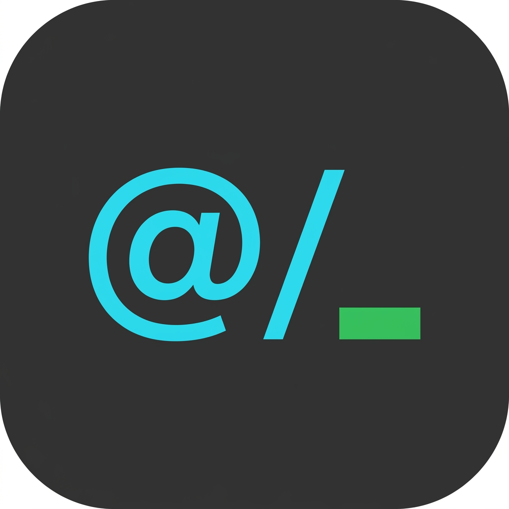

# At Mention Bridge



At Mention Bridge copies and inserts references that agent CLIs can understand. Use it from the editor or Explorer to send the current file, folder, or selected lines to Claude Code, OpenAI Codex CLI, Gemini CLI, OpenCode, Aider, and other terminal agents.

## Features

- Copy a file, folder, or editor selection as an `@` reference.
- Insert the rendered reference into a linked VS Code integrated terminal without executing it.
- Use built-in Claude-style and Codex-style templates.
- Add your own named templates with VS Code settings.
- Link, select, and cycle terminal agent targets from the Command Palette or status bar.
- Detect supported agent commands from terminal shell integration, terminal names, local process trees, and tmux panes where available.
- Use editor and Explorer context menus, including "Copy @-Mention Reference As..." for choosing any configured template.

## Commands

| Command | Default macOS Keybinding | Default Windows/Linux Keybinding |
| --- | --- | --- |
| Copy @-Mention Reference | `Option+Command+K` | `Alt+Ctrl+K` |
| Insert @-Mention Reference | `Option+K` | `Alt+K` |
| Link Active Terminal | Command Palette | Command Palette |
| Select Target Agent | Command Palette or status bar | Command Palette or status bar |
| Next Target Agent | Command Palette | Command Palette |
| Select Default Template | Command Palette | Command Palette |
| Show Logs | Command Palette | Command Palette |

The copy and insert shortcuts work in the editor and Explorer. Explorer keyboard support uses VS Code's built-in file-path copy command to resolve the focused selection.

## Reference Formats

The extension ships with two templates:

```json
{
  "atMentionBridge.defaultTemplate": "claudeStyle",
  "atMentionBridge.templates": {
    "claudeStyle": "@${relativePath}${locationSuffix}",
    "codexStyle": "[${fileName}${locationSuffix}](${absolutePath}${locationSuffix})"
  }
}
```

Claude-style examples:

```text
@src/extension.ts
@src/extension.ts#24-26
@src/
```

Codex-style examples:

```text
[extension.ts](/absolute/path/to/src/extension.ts)
[extension.ts#24-26](/absolute/path/to/src/extension.ts#24-26)
[src/](/absolute/path/to/src/)
```

Copy and insert commands use `atMentionBridge.defaultTemplate` unless you explicitly choose a template from "Copy @-Mention Reference As...".

## Custom Templates

Templates are JavaScript template-literal strings. Available variables:

| Variable | Description |
| --- | --- |
| `${relativePath}` | File or folder path relative to the workspace root, or an absolute path when outside the workspace. Folder paths end with `/`. |
| `${absolutePath}` | Absolute file or folder path. Folder paths end with `/`. |
| `${fileName}` | Basename such as `README.md` or `src/`. |
| `${locationSuffix}` | `#24-26`, `#24`, or an empty string. |
| `${lineStart}` | 1-indexed inclusive selection start line. |
| `${lineEnd}` | 1-indexed inclusive selection end line. |
| `${isDirectory}` | Boolean directory flag. |

Example:

```json
{
  "atMentionBridge.templates": {
    "compact": "${fileName}${locationSuffix} -> ${absolutePath}",
    "claudeStyle": "@${relativePath}${locationSuffix}",
    "codexStyle": "[${fileName}${locationSuffix}](${absolutePath}${locationSuffix})"
  }
}
```

Only use templates you trust. They are evaluated as JavaScript template literals so advanced expressions work, but malicious templates can execute code in the extension host.

## Terminal Targets

Supported built-in agents include Claude Code, OpenAI Codex CLI, Gemini CLI, OpenCode, Aider, GitHub Copilot CLI, Goose, Crush, Amp, Qwen Code, Kimi Code, CodeBuddy Code, Kilo Code, Qoder CLI, Trae Agent, and Antigravity.

Discovery uses the public VS Code terminal API first, then best-effort local process scanning. If discovery cannot identify the target terminal, run **At Mention Bridge: Link Active Terminal** while the agent terminal is focused.

## Settings

| Setting | Default | Description |
| --- | --- | --- |
| `atMentionBridge.defaultTemplate` | `claudeStyle` | Template used by default for copy and insert commands. Use **At Mention Bridge: Select Default Template** to choose from configured template keys. |
| `atMentionBridge.templates` | Built-in `claudeStyle` and `codexStyle` templates | Named templates available to copy and insert commands. `claudeStyle` renders `@${relativePath}${locationSuffix}`; `codexStyle` renders `[${fileName}${locationSuffix}](${absolutePath}${locationSuffix})`. |
| `atMentionBridge.autoLinkActiveAgentTerminal` | `true` | Automatically link the active terminal when a supported agent is detected. |
| `atMentionBridge.showCopyNotifications` | `true` | Show a short status-bar message after copying. |

## Development

```bash
npm install
npm run compile
npm test
```

Use **Run Extension** in VS Code to launch an Extension Development Host. CI runs typechecking, linting, extension tests, and VSIX packaging.
